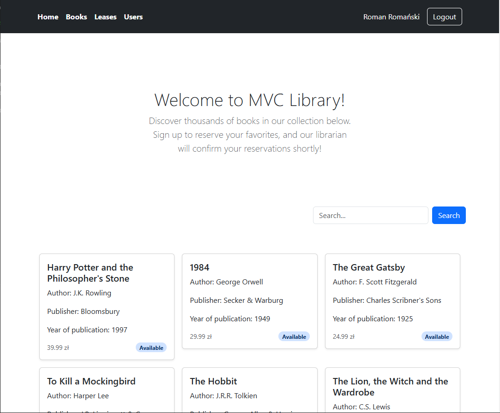
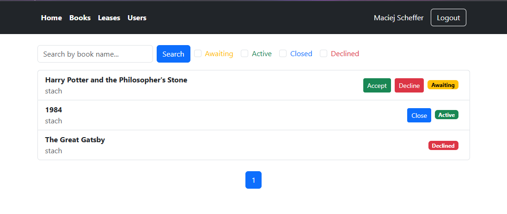
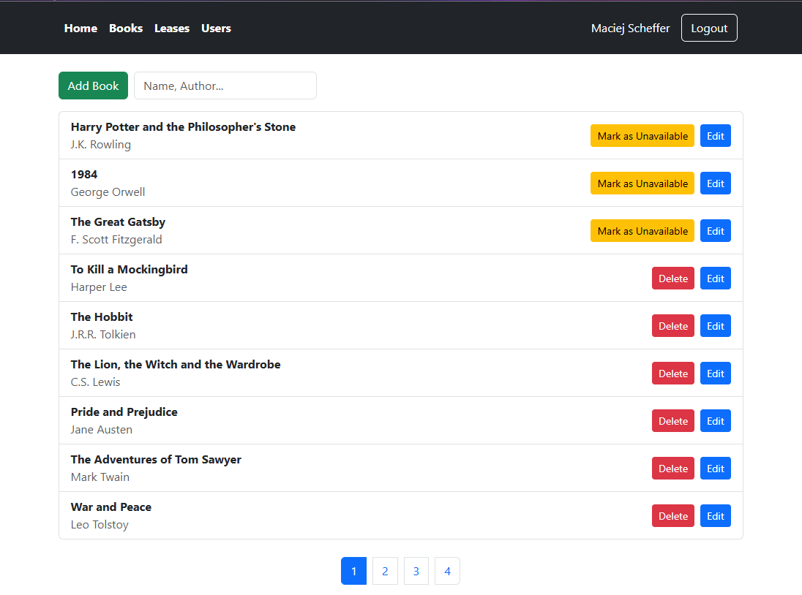

# MVC_Library
Aplikacja webowa z podziałem na backend (ASP.NET MVC C#) oraz frontend (React TS). Funkcjonalność aplikacji składa się z weryfikacji oraz autoryzacji użytkownika, zarządzaniem tokenami JWT oraz obsługi CRUD modeli biblioteki

## Zdjęcia




## Projekt 1: Biblioteka ASP.NET MVC
#### Uruchomienie
Projekt uruchamiany jest poprzez docker-compose komendą
``` sh
    sudo docker build .
    docker-compose up --build
```
Po paru minutach aplikacja będzie dostępna pod adresem localhost na porcie 8080
#### Dane inicjacyjne bazy danych
Baza danych uruchomi się 31 rekordami książek oraz 2 rekordami użytkowników
##### Użytkownicy
- **Nazwa**: admin **Hasło**: Hasło1234$  
Jest to konto użytkownika "Librarian" mającego kontrolę nad aplikacją
- **Nazwa**: stach **Hasło**: Hasło4321$  
Jest to przykładowe konto użytkownika, posiadającego domyślne uprawnienia.

Zarządzanie sesją realizowane jest przez Microsoft Identity

## Projekt 2: Równoległość Edycji ASP.NET MVC
Dodanie do pierwszego projektu obsługi równoległości edycji danych. Ponieważ założeniem zadania drugiego było dodanie obsługi w tylko jednym miejscu, działa ona jedynie przy zmianie statusu rezerwacji na "Aktywny" przez administratora.
##### Użytkownicy
W celu zbadania działania obsługi równoległości, dodano nowego użytkownika "Librarian"
- **Nazwa**: admin2 **Hasło**: Hasło1234$

Obsługa równoległości została zrealizowana poprzez ConcurrencyCheck

## Projekt 3 i 4: Przeniesienie Frontendu do React TS
Zamiana kontrolerów z widokami na kontrolery API w plikach manageLogin oraz manageBooks, dzięki czemu możliwa jest obsługa książek oraz logowania przy użyciu frontendu w React TS.
##### Uruchamianie
Backend w .NET uruchamiany jest jak poprzednio, frontend uruchomić należy poleceniem
``` sh
cd react_ts_frontend
npm install
npm start
```
